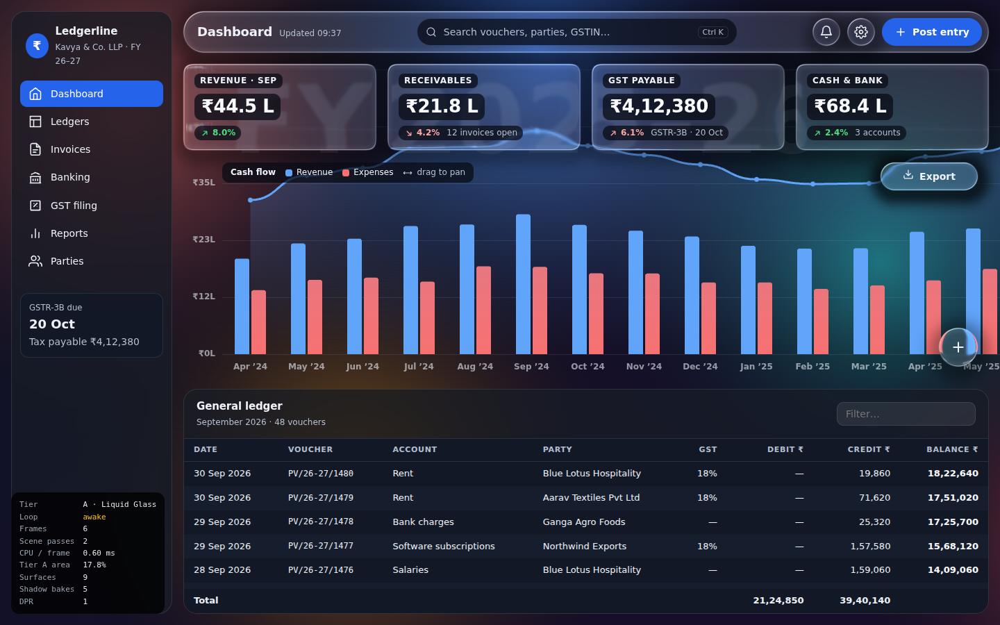
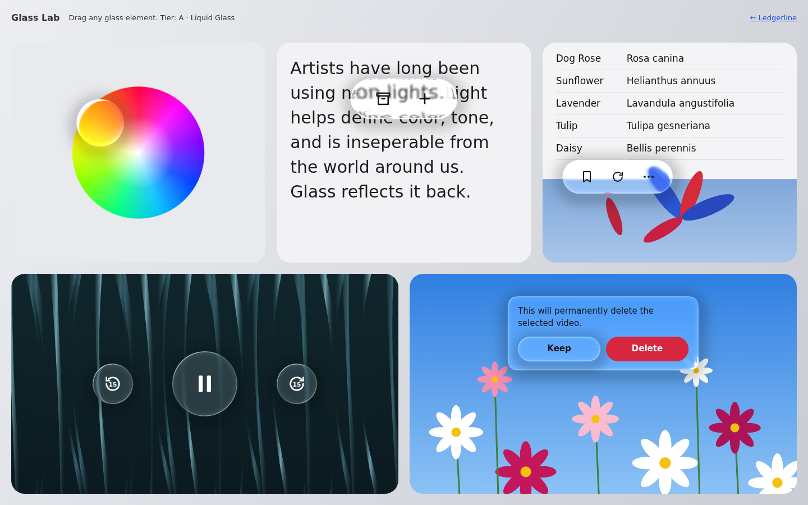
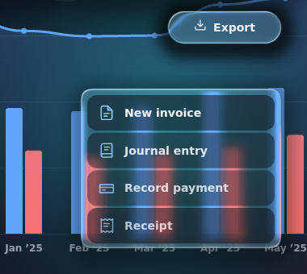
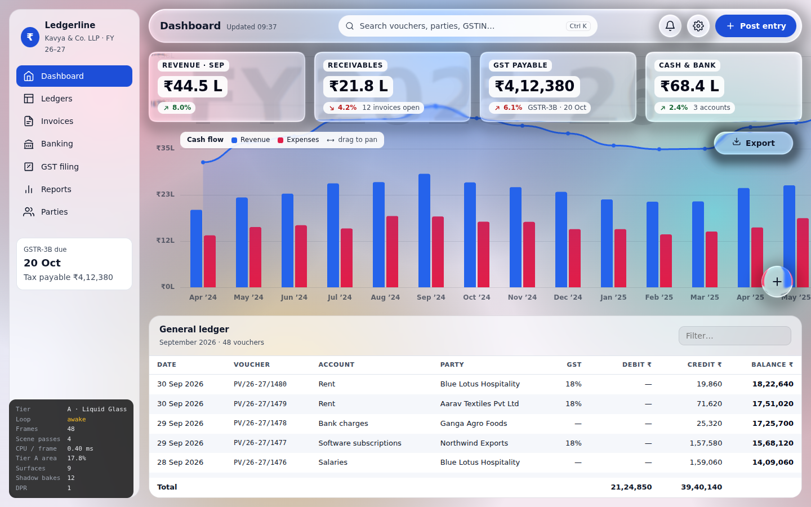
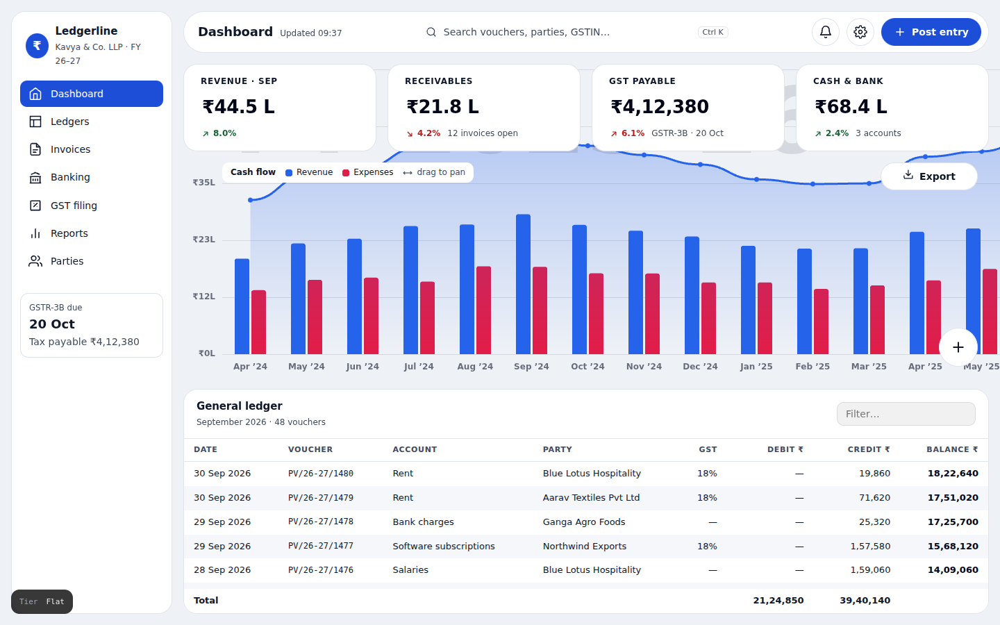

# Ledgerline — Liquid Glass material system

A working, production-structured implementation of the **Liquid Glass build brief**: a two-tier glass
material for an Electron + Vite accounting app (TypeScript, React, Chromium 120+).



**Glass Lab** (`lab.html`) recreates the WWDC25 reference scenes — colour-wheel drop, capsule over text,
toolbar over a list and photo, controls over dark video, alert over flowers. Every element is draggable.



| Melt menu (FAB → menu) | Light theme | Flat theme |
| --- | --- | --- |
|  |  |  |

## Run it

```bash
npm install
npm run dev              # browser: http://localhost:5173  (lab: /lab.html)
npm run electron:dev     # Electron window against the dev server (run `npm run dev` first)
npm run build && npm run electron   # Electron against the production build
npm test                 # geometry, waves/gestures, shadow field, contrast audit
```

URL switches (diagnostics): `?tier=b` forces Tier B, `?tier=a` skips only the software-rasteriser check (for
headless visual testing), `?debug` exposes the renderer as `window.__glass`.

## The two tiers

| | Tier A — Liquid Glass | Tier B — Frosted |
| --- | --- | --- |
| Built with | one WebGL2 canvas (`src/glass`) | CSS `backdrop-filter` (`.surface-b`, `.glass.tier-frost`) |
| Used on | toolbar, KPI cards, icon buttons, FAB/melt menu, split control, journal dialog | sidebar, ledger, toast, settings popover |

`useGlass()` returning `null` turns every Tier A panel into a Tier B one — one switch. It is null when:
no WebGL2, a software rasteriser (SwiftShader/llvmpipe), `MAX_TEXTURE_SIZE < 4096`,
`prefers-reduced-transparency`, WebGL context lost (recovers automatically), battery < 25% and not charging,
or the user picked *Frosted* / *Flat* in settings.

## Layout

```
src/glass/
  GlassRenderer.ts   context, resources, frame loop, rect sync, exact sleep, context loss
  scene.ts           scene composite + box ½ → box ¼ → gauss H → gauss V (only when dirty)
  material.ts        baked R8 shadow cache keyed by geometry
  waves.ts           wave source pool + gesture classification (tap, firm, hold, drag, flick)
  capability.ts      feature detection → the single null
  geometry.ts        concentric radius, bevel fraction, melt/staging curves
  springs.ts         critically damped springs + fixed tweens (both settle exactly)
  GlassContext.tsx   provider, useGlass(), GlassLayer
  GlassPanel.tsx     registers a rect, renders DOM children
  Morph.tsx          MeltMenu (melt + anchored growth), SplitControl (split/merge)
  shaders/           §3 shader + pass shaders, imported with ?raw
src/app/             the accounting demo (tokens, backdrop art, ledger, dialog, settings, HUD)
electron/main.cjs    BrowserWindow with backgroundMaterial: 'mica'
```

## What was verified

Verified in headless Chromium (SwiftShader, via the `?tier=a` override) and by `npm test`:

- **Idle = zero frames.** The HUD's frame counter stops after ~4 frames and stays stopped; the rAF loop is not rescheduled.
- **No colour cast**: glass over the red and blue bars keeps their hue; no tint is ever added.
- **Magnification**: the lens term visibly magnifies the "FY 2025–26" watermark and chart labels behind small controls.
- **Ripples** bend the backdrop with signed, directional sheen; a firm tap never washes the panel white.
- **Melt / split / press** transitions: bloom, staged labels, anchored growth, thin-neck split.
- **Context loss** via `WEBGL_lose_context` → Tier B → back to Tier A on restore (also a button in Settings).
- **Contrast audit** (`src/app/contrast.test.ts`) — 4.5:1 body, 7:1 figures, against the brightest and darkest
  backdrop of each theme; tokens in `src/app/tokens.ts` are the single source for CSS and the audit.
- Tier A area on the busiest screen: 17.8% (dashboard), 23.9% (dialog open).

Not verified here (needs real hardware): `--disable-gpu` in a packaged Electron build, an integrated Intel GPU
with an old driver, and OS-level GPU usage readings. The HUD's frame counter is the in-app proxy.

## Deviations from the brief, and why

- **Shader additions (both uniform-driven):** `sdAll` also blends the dominant shape's centre/half-size so the
  lens follows each shape after a split, and `uWd` carries flick direction/anisotropy (§5 lists flick; the §3
  shader had no input for it).
- **Refraction profile, matched to the reference frames** (the brief's smoothstep bevel read as a soft shading shift):
  - *Rim compression*: the bevel samples up to `2.4 × thickness` beyond the rim with a `(1 − t)³` falloff, so
    content outside the element is squeezed into the rim band (the list row pulled into the toolbar's top edge,
    the leaf smeared into its cap). `(1 − t)³` has zero first and second derivative where the bevel ends — no seam.
  - *Size-relative lens*: magnification is a fraction of the half-size (`lensMagnification`: 0.12 on controls →
    0.03 on large panels), not a fixed pixel offset.
  - *Clear sampling*: controls, toolbars and cards (≤160px min-dimension) sample a half-res source with a light
    2.5px gaussian; only large surfaces take the heavy blur, now 10px instead of 15px.
  - *Hairline rim, lit on both diagonals* (bright top-left, softer bottom-right), DPR-scaled.
  - *Dark-backdrop lift 0.07* instead of 0.13, plus a 5% neutral veil: 0.13 turned controls over dark video
    into grey discs where the reference shows a faint lightening.
- **Wave gain (`uWGain = 2.5 × dpr`)**: wave sizes are in device px, so the analytic gradient shrinks by 1/dpr;
  at the brief's amplitudes the ripples were invisible here. The gain is applied after the amplitude floor, so the
  CPU-side death time — and exact sleep — are unchanged.
- **Bloom under the AA edge**: without it the band between glass and bloom drew a dark outline at the melt peak (bug #1).
- **Radius rule**: the brief's "round below 60px" is kept for the app; the lab's larger playback controls and
  capsules pass an explicit full radius, as in the reference.
- **Settings popover is Tier B**: its backdrop is live DOM (the KPI cards). Canvas glass is drawn under all DOM,
  so by the brief's own rule it is not a Tier A candidate. The dialog stays Tier A by fading the page behind it.
- **Not built:** direct-interpolation cross-dissolve (sidebar → tab bar) and the proximity lens.
